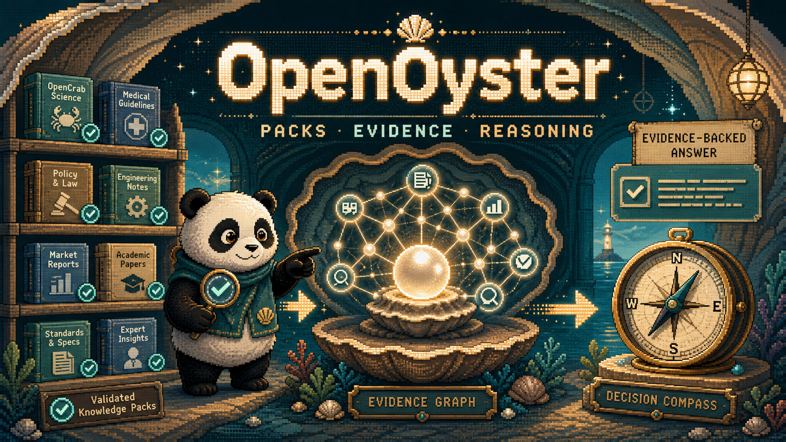

# OpenOyster

[](https://github.com/Pandoll-AI/OpenOyster)
[](LICENSE)
[](pyproject.toml)
[](tests)
[](docs/API_REFERENCE.md)
[](README-en.md)

> 한국어 우선 문서입니다. English documentation is available in [README-en.md](README-en.md).

<p align="center">
  
</p>

**OpenOyster는 OpenCrab Pack을 사실 입력으로만 사용하는 자율 숙의 도구입니다.**

질문에 답하는 데서 멈추지 않습니다. 하나의 Mission을 받아 믿음, 대안, 불리한
시나리오, 반론을 구성하고, 선택하거나 기권합니다. 무엇이 바뀌면 결정을 뒤집어야
하는지와 어떤 지식이 더 필요한지도 함께 남깁니다.

한 문장으로 정리하면 이렇습니다.

> OpenCrab이 지식을 만들면, OpenOyster는 그 지식으로 생각하고 결정한다.

# 왜 필요한가

잘 정리된 지식 그래프도 그 자체로는 결정이 아닙니다. 실제 판단에는 서로 다른
근거를 연결하고, 충돌을 드러내고, 대안을 비교하고, 실패 가능성을 상상하는 과정이
필요합니다.

일반적인 RAG 답변은 “무엇을 찾았는가”를 설명합니다. OpenOyster는 여기서 한 단계
더 나아가 다음 질문을 다룹니다.

- 지금 믿을 수 있는 것은 무엇인가?
- 근거가 충돌하는 지점은 어디인가?
- 실행 가능한 대안은 무엇인가?
- 어떤 제약 때문에 제외되는가?
- 불리한 조건에서는 어떻게 실패하는가?
- 지금 선택해야 하는가, 더 알아볼 때까지 기권해야 하는가?
- 어떤 새로운 근거가 들어오면 결정을 뒤집어야 하는가?

이 때문에 OpenOyster의 핵심 산출물은 채팅 답변이 아니라 **Decision Dossier**입니다.

# OpenCrab과의 역할 분리

OpenCrab과 OpenOyster는 경쟁 제품이 아니라 앞뒤로 연결되는 두 계층입니다.

```text
원천 자료
  ↓
OpenCrab
  지식 수집 · 구조화 · 검증 · Pack 생성/갱신
  ↓ OpenCrab Pack
OpenOyster
  믿음 형성 · 대안 생성 · 시나리오 · 반론 · 결정/기권
  ↓
Decision Dossier + Knowledge Requests
```

OpenOyster는 입력을 의도적으로 OpenCrab Pack으로 제한합니다. 웹 검색, 모델의 사전
지식, Mission에 적힌 사실 같은 내용을 몰래 근거로 승격하지 않습니다.

- Pack 생성과 갱신은 OpenCrab의 역할입니다.
- Knowledge Request는 OpenCrab이나 사람에게 전달할 요청입니다. OpenOyster가
  자동으로 검색하거나 Pack을 고치지 않습니다.

# 지금 실제로 수행하는 일

Autonomous Deliberation D1은 Mission 하나와 설치된 Pack 집합을 받아 다음 흐름을
한 번에 실행합니다.

```text
Mission
  ↓
정확한 Pack install ID 동결
  ↓
Evidence snapshot
  ↓
Belief State
  ↓
Options + hard-constraint 판정
  ↓
Expected / Adverse Scenarios
  ↓
Independent Critic
  ↓
Selection 또는 Abstention
  ↓
Flip Conditions + Knowledge Requests
  ↓
Cognitive Impact + Decision Dossier + Audit Replay
```

정상 실행은 다섯 개의 유계 LLM stage를 사용합니다.

1. `deliberation_beliefs` — 지지·반대 근거를 가진 atomic belief를 만듭니다.
2. `deliberation_options` — 대안과 모든 Mission 제약을 연결합니다.
3. `deliberation_scenarios` — 각 대안의 기본·불리한 결과를 구성합니다.
4. `deliberation_critic` — 누락 대안, 증거 편향, 제약 오해, 과도한 주장을 검사합니다.
5. `deliberation_decision` — 선택 또는 기권, 전환 조건, 지식 요청을 만듭니다.

근거가 없으면 모델을 부르지 않고 기권합니다. critic이 통과하지 못하거나 실행 가능한
대안이 부족해도 억지로 선택하지 않습니다.

완료된 기권 run에 저장된 Knowledge Request를 OpenCrab 또는 사용자가 충족했다고
주장하면, 명시한 새 Pack ID로 `deliberate continue`를 실행할 수 있습니다. 새로 인용된
Evidence가 확인돼야 verified fulfilled로 승격됩니다. 자식 run은 부모 Mission을 동결하고
`parent_run_id`로 연결되며, `cognitive_transition_v2`가
belief·option·critic·decision·citation scope의 변화를 보여 줍니다. Pack 내용 자체의
diff를 계산하거나 외부 사실을 발견하지는 않습니다. 자세한 계약은
[Decision Continuity D2 요구사항](docs/DECISION_CONTINUITY_D2_REQUIREMENTS.md)을
참조하세요.

# 근거를 믿는 방법

OpenOyster는 단순한 citation ID만으로 사실을 인정하지 않습니다.

- 실행 전에 정확한 Pack 설치 ID와 digest를 고정합니다.
- 모델에 보여 준 evidence만 snapshot으로 저장합니다.
- grounded assertion마다 정확한 문장 인용 또는 JSON pointer를 요구합니다.
- 인용 문장이 evidence text에 실제로 존재하는지 검사합니다.
- JSON pointer가 정확한 값과 digest로 해석되는지 검사합니다.
- local-only ID, 다른 Pack의 ID, 조회되지 않은 evidence는 거부합니다.
- Mission의 목표와 제약은 제어 입력일 뿐 evidence가 아닙니다.

정확한 인용은 출처를 증명하지만 의미적 함의까지 수학적으로 보장하지는 않습니다.
그래서 별도의 critic stage와 기권 경로를 둡니다.

# Decision Dossier에 들어가는 것

각 실행은 JSON과 Markdown 두 형식으로 저장됩니다.

- Mission snapshot과 digest
- 사용한 Pack ID, version, install ID, source digest
- belief와 상충 근거
- option, 제외 이유, hard-constraint 판정
- expected/adverse scenario
- critic 결과
- 선택 또는 기권과 그 근거
- 결정을 뒤집는 flip condition
- 부족한 지식을 명시한 Knowledge Request
- citation-scope 기반 Cognitive Impact
- evidence anchor와 stage/model/effort 정보

`replay`는 LLM을 다시 호출하지 않습니다. 저장된 입력과 산출물을 재검증하고 dossier를
다시 렌더링해 digest가 같은지 확인합니다. 새로운 모델 호출은 replay가 아니라 별도의
새 실행이어야 합니다.

# 5분 실행

Python 3.11–3.13을 지원합니다.

```bash
python -m venv .venv
source .venv/bin/activate
python -m pip install --upgrade pip
pip install -e ".[dev]"

openoyster init
```

먼저 예제 OpenCrab Pack을 설치합니다. 이 fixture는 네 파일짜리 compatible Pack이므로
D1 실행에서 명시적으로 허용합니다.

```bash
openoyster pack install tests/fixtures/opencrab_pack_runtime/p0-f1-minimal
```

기능 흐름을 빠르게 확인하려면 stub provider를 사용합니다. Stub은 테스트용이며 실제
판단 품질을 의미하지 않습니다.

```bash
export OPENOYSTER_LLM_PROVIDER=stub

openoyster deliberate run tests/fixtures/deliberation_d1/mission_happy.json \
  --packs p0-f1-minimal \
  --impact-baseline-packs p0-f1-minimal \
  --allow-compatible-packs \
  --idempotency-key demo-d1-001
```

출력에서 `id`를 확인한 뒤 전체 결과를 조회합니다.

```bash
openoyster deliberate show RUN_ID
openoyster deliberate dossier RUN_ID --format markdown
openoyster deliberate impact RUN_ID
openoyster deliberate knowledge-requests RUN_ID
openoyster deliberate replay RUN_ID
```

기권 후 새 Pack으로 이어서 실행하는 예시는 다음과 같습니다.

```bash
openoyster deliberate continue PARENT_RUN_ID \
  --packs new-pack-id \
  --fulfills kr_no_evidence \
  --idempotency-key demo-d2-001
openoyster deliberate transition CHILD_RUN_ID
```

기본 provider는 `codex`입니다. 실제 로컬 생성에는 Codex CLI와
`.codex-llm/models.json`, `.codex-llm/pipeline.json` 설정이 필요합니다.

```bash
unset OPENOYSTER_LLM_PROVIDER
openoyster doctor
```

# Mission 작성법

Mission은 YAML 또는 JSON으로 작성합니다.

```yaml
goal: 되돌릴 수 있는 대응안을 선택한다
decision_question: 현재 Pack 근거로 어떤 대응을 선택해야 하는가?
constraints:
  - Pack 밖의 사실을 사용하지 않는다
  - 되돌릴 수 없는 행동은 선택하지 않는다
preferences:
  - 불확실할 때는 정보 획득을 우선한다
deadline: null
context: 이 내용은 제어용 배경이며 사실 근거가 아니다
```

`goal`과 `decision_question`은 필수입니다. `constraints`, `preferences`, `deadline`,
`context`, `mission_charter_id`는 선택 사항입니다. Mission 안의 문장이 사실처럼 보여도
Pack evidence를 대신할 수 없습니다.

# Cognitive Impact

Cognitive Impact는 Pack diff가 아닙니다. 사용자가 지정한 primary Pack 집합과 baseline
부분집합을 비교해, 현재 결정의 인용 근거가 baseline에서도 유지되는지만 계산합니다.

- `retained` — 인용 근거가 baseline에 모두 남아 있습니다.
- `partially_supported` — 일부 근거만 남아 있습니다.
- `unsupported` — 근거가 baseline에 없습니다.

최종 decision support는 `retained`, `weakened`, `lost`로 집계합니다. 이 기능은 Pack의
업데이트나 삭제 원인을 추론하지 않으며, baseline만으로 새로 실행했을 때 나올 다른
추론을 예측하지도 않습니다.

# CLI 지도

```text
openoyster pack validate PATH [--profile compatible|strict]
openoyster pack install PATH [--profile compatible|strict]
openoyster pack list
openoyster pack show PACK_ID
openoyster pack query "QUESTION" [--packs PACK_ID,...]

openoyster deliberate run MISSION.yaml --packs PACK_ID,... --idempotency-key KEY
openoyster deliberate show RUN_ID
openoyster deliberate dossier RUN_ID --format json|markdown
openoyster deliberate replay RUN_ID
openoyster deliberate impact RUN_ID
openoyster deliberate knowledge-requests RUN_ID

openoyster serve
openoyster status
openoyster doctor
openoyster db upgrade
```

기존 durable signal/hypothesis runtime도 유지됩니다. 파일·URL·RSS·GitHub 읽기,
event-driven loop, evidence inspection, policy/evaluation 명령은 상세 매뉴얼에서 확인할 수
있습니다.

# API

모든 D1 endpoint는 설정된 API key를 요구합니다. 생성 요청에는
`Idempotency-Key`도 필요합니다.

```text
POST /v1/deliberations
GET  /v1/deliberations/{id}
GET  /v1/deliberations/{id}/dossier
POST /v1/deliberations/{id}/replay
GET  /v1/deliberations/{id}/cognitive-impact
GET  /v1/deliberations/{id}/knowledge-requests
```

API 응답에는 raw Pack body, 전체 prompt, server path, storage URI, secret이 포함되지
않습니다. 요청 예시는 [API Reference](docs/API_REFERENCE.md)에 있습니다.

# 로컬 서비스 실행

```bash
./run.sh start
./run.sh stop
./run.sh restart
```

`run.sh`는 `0.0.0.0:3388`에 바인딩하고 Tailscale IPv4 URL을 출력하는 임시 로컬 개발
런처입니다. 정식 장기 운영에는 macOS `launchd`, 컨테이너, 또는 원격 서버 배포를
사용해야 합니다.

# 검증

```bash
PATH="$PWD/.venv/bin:$PATH" make check
```

현재 검증 범위는 다음을 포함합니다.

- Ruff와 mypy
- 145개 unit/integration test
- Pack source 불변성
- D1 contract, migration, runtime, CLI/API
- SQLite migration upgrade/downgrade
- sdist와 wheel build

# 의도적으로 하지 않는 일

- OpenCrab Pack 생성·자동 갱신·revision diff·rollback
- 웹 검색이나 모델 사전 지식의 evidence 승격
- Knowledge Request 자동 수행
- 범용 자율 agent와 외부 시스템 write action
- 사람 승인 없는 고위험 결정 자동 집행

OpenOyster는 현재 알파입니다. 높은 위험의 판단에는 dossier와 evidence를 사람이
검토해야 합니다.

# 프로젝트 구조

```text
src/openoyster/
  deliberation_contracts.py       D1의 닫힌 데이터 계약
  api/                             FastAPI와 D1 endpoint
  migrations/                     Pack/D1 Alembic schema
  services/
    opencrab_packs.py              Pack 검증·불변 설치
    pack_retrieval.py              Pack-aware retrieval
    deliberation.py                다섯 stage 오케스트레이션
    deliberation_gates.py          근거·참조·선택 gate
    deliberation_dossier.py        JSON/Markdown dossier
    deliberation_replay.py         LLM-free audit replay
    cognitive_impact.py            citation-scope projection

tests/
  fixtures/opencrab_pack_runtime/  OpenCrab Pack fixtures
  fixtures/deliberation_d1/        Mission fixture
  test_deliberation_*.py           D1 contract/runtime/API/migration tests
```

# 문서

- [Autonomous Deliberation D1 요구사항](docs/AUTONOMOUS_DELIBERATION_D1_REQUIREMENTS.md)
- [Decision Continuity D2 요구사항](docs/DECISION_CONTINUITY_D2_REQUIREMENTS.md)
- [한국어 사용자 매뉴얼](docs/USER_MANUAL_KO.md)
- [English User Manual](docs/USER_MANUAL.md)
- [API Reference](docs/API_REFERENCE.md)
- [OpenCrab Pack Runtime Requirements](docs/OPENCRAB_PACK_RUNTIME_REQUIREMENTS.md)
- [MVP-P1 Final Acceptance](docs/delegation/MVP-P1_FINAL_ACCEPTANCE.md)
- [Architecture](docs/ARCHITECTURE.md)
- [Operations](docs/OPERATIONS.md)
- [Threat Model](docs/THREAT_MODEL.md)
- [Coding Delegation Contract](docs/CODING_DELEGATION_CONTRACT.md)

# 기여

기여 전 [CONTRIBUTING.md](CONTRIBUTING.md)와
[Contributor Manual](docs/CONTRIBUTOR_MANUAL.md)을 읽어주세요.

새 기능은 다음 원칙을 지켜야 합니다.

- Pack-only factual boundary를 약화하지 않습니다.
- Mission과 evidence를 분리합니다.
- 새 narrative field에는 epistemic classification과 검증 gate를 둡니다.
- 관련 RED/GREEN 테스트를 추가합니다.
- `make check`를 통과합니다.
- 외부 write capability에는 명시적 승인 경계를 둡니다.
